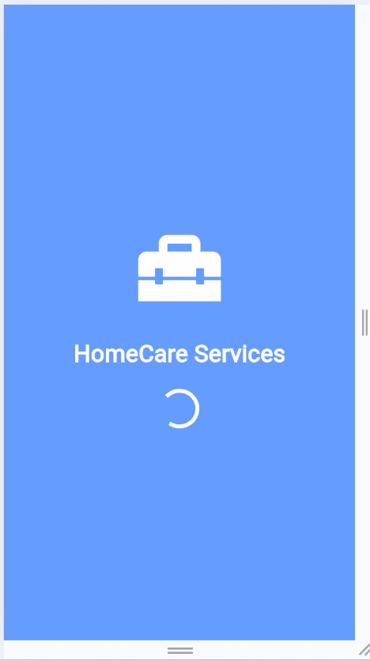
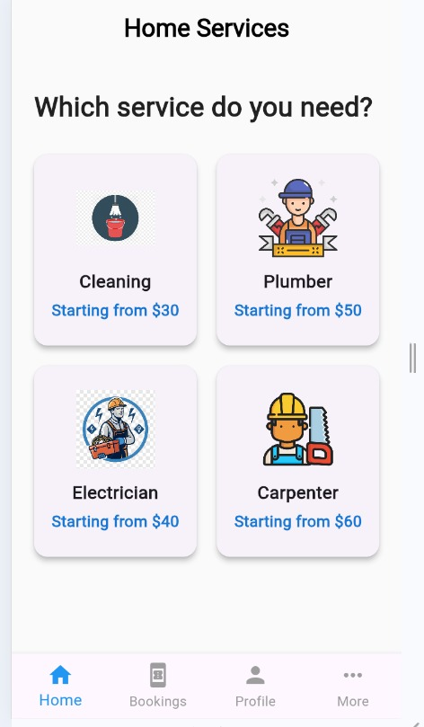
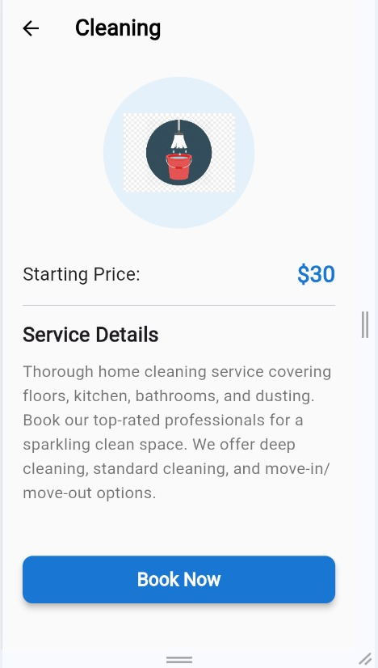
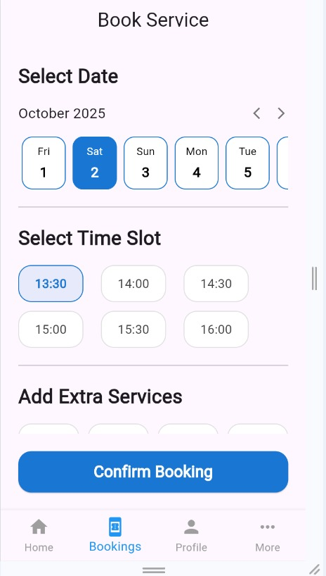
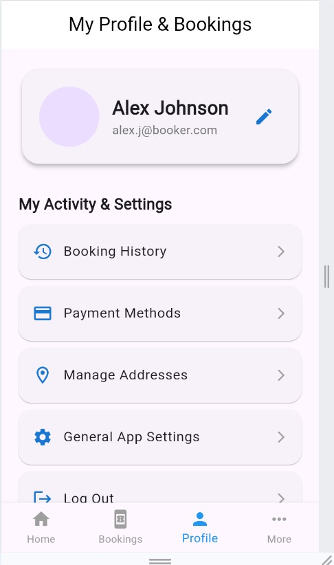

# Ghar Seva – Home Services App (Flutter UI)

Ghar Seva is a Flutter-based *frontend UI application* for a home services platform.
The app allows users to browse household services, view service details, book services,
and manage their profiles through a clean and intuitive interface.

> ⚠ This project focuses on *UI development only*. Backend integration will be added in future versions.

---

## ✨ Features
- Splash screen and onboarding UI
- Home screen with available services
- Service details page
- Book service screen
- User profile screen
- Clean and responsive Flutter UI

---

## 🛠 Tech Stack
- Flutter
- Dart
- Material UI

---

## 📸 App Screenshots

### Splash Screen


### Home Screen


### Service Details


### Book Service


### Profile Screen


---

## 🚀 Getting Started

1. Clone the repository:
```bash
git clone https://github.com/varshitha211/ghar-seva-flutter-ui.git

2. Navigate to the project directory:
  cd ghar-seva-flutter-ui
3. Install dependencies:
   flutter pub get
4. Run the app:
  flutter run
🔮 Future Enhancements
Backend integration
Authentication (Login / Signup)
Payment gateway
Real-time booking status
👩‍💻 Author
Amara Krupa Varshitha
GitHub: https://github.com/varshitha211
LinkedIn: https://www.linkedin.com/in/amarakrupavarshitha/
